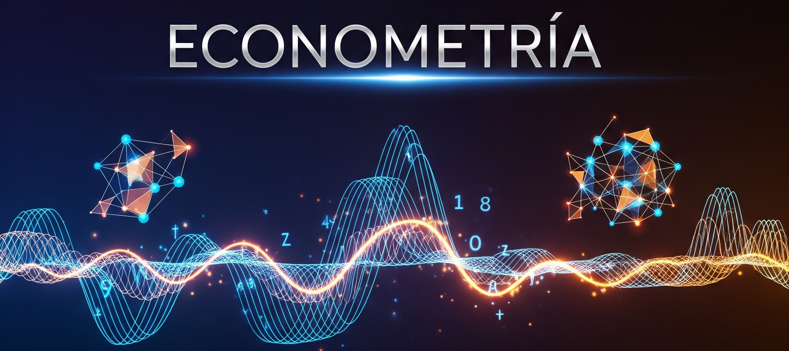

**Curso de Econometría**

La econometría es una herramienta esencial en la investigación económica, que integra teoría económica, estadística y matemáticas para analizar y cuantificar relaciones entre variables económicas. Este curso, impartido en el aula universitaria, ofrece una introducción rigurosa al uso de modelos econométricos como instrumentos para estudiar y predecir fenómenos económicos a partir de datos reales.
