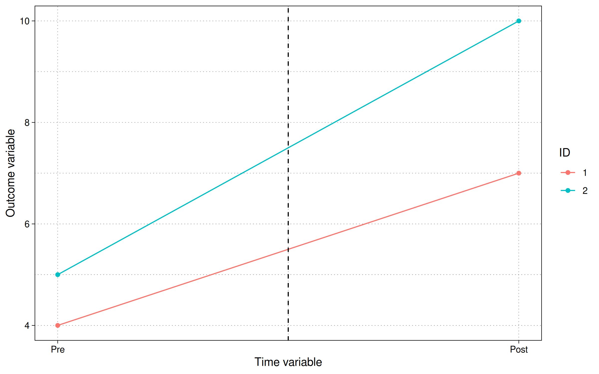
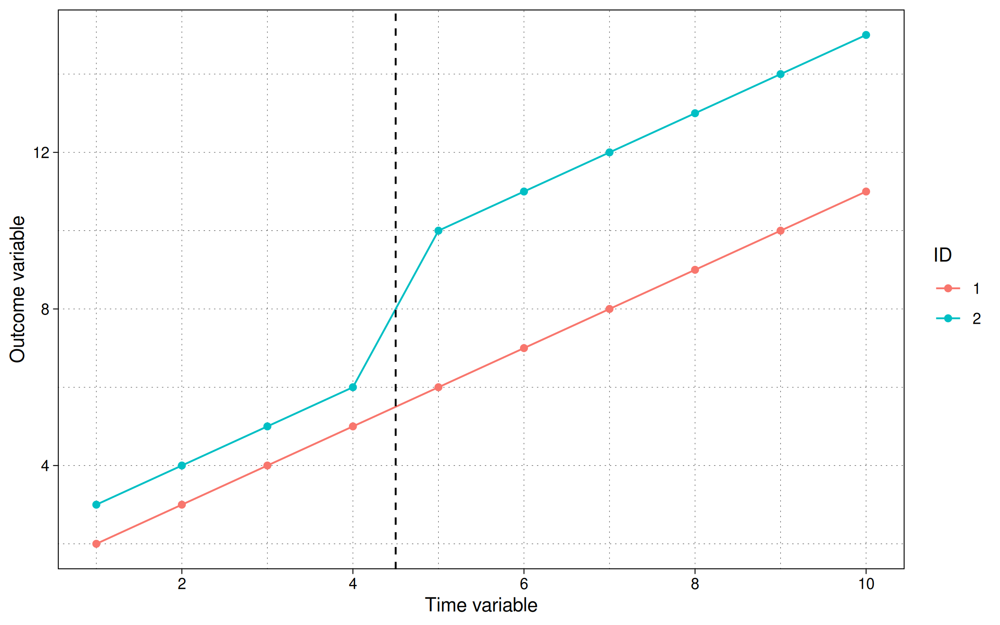
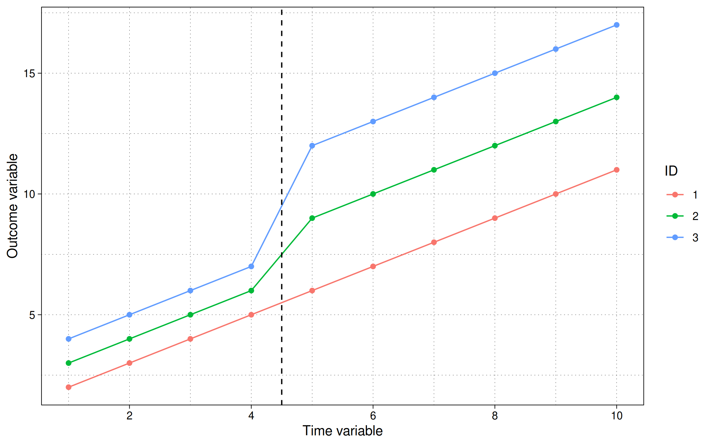
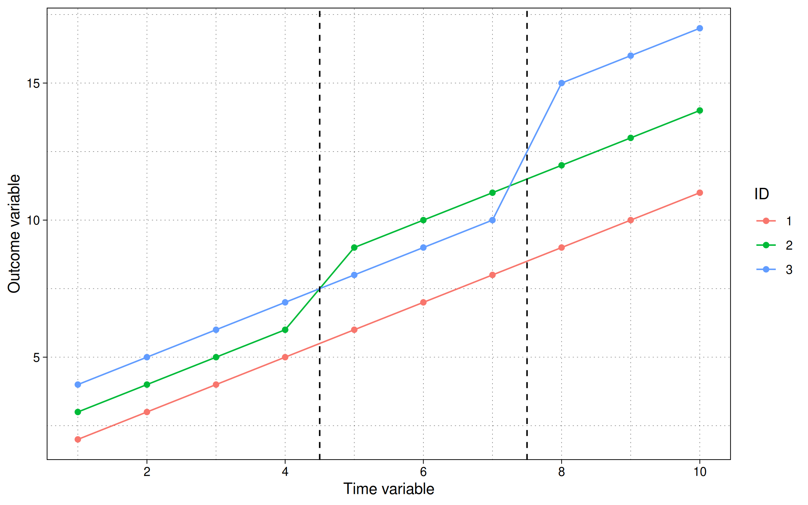

# The Twoway Fixed Effects (TWFE) model
{: .no_toc }

## Table of contents
{: .no_toc .text-delta }

1. TOC
{:toc}

---

## The classic 2x2 DiD or the Twoway Fixed Effects Model (TWFE)

Let us start with the classic Twoway Fixed Effects (TWFE) model:

$$ y_{it} = \beta_0 + \beta_1 Treat_i + \beta_2 Post_t + \beta_3 Treat_i Post_t + \epsilon_{it}  $$

The above two by two (2x2) model can be explained using the following
table:

|              | Treatment = 0          | Treatment = 1                               | *Difference*            |
|--------------|------------------------|---------------------------------------------|-------------------------|
| **Post = 0** | $$ \beta_0 $$          | $$ \beta_0 + \beta_1 $$                     | $$ \beta_1 $$           |
| **Post = 1** | $$\beta_0 + \beta_2 $$ | $$ \beta_0 + \beta_1 + \beta_2 + \beta_3 $$ | $$ \beta_1 + \beta_3 $$ |
| Difference   | $$ \beta_2 $$          | $$ \beta_2 + \beta_3 $$                     | $$ \beta_3 $$           |

------------------------------------------------------------------------

## The triple difference estimator (DDD)

*incomplete*

The triple difference estimator essential takes two DDs, one with the
target unit of analysis with a treated and an untreated group. This is
compared to another similar group in the pre and post-treatment period.
Fo effectively there are two treatments. One where an actual treatment
on the desired group is tested, and a placebo comparison group, on which
the same intervention is also applied.

$$ y_{it} = \beta_0 + \beta_1 P_{i} + \beta_2 C_{j} + \beta_3 T_t + \beta_4 (P_i T_t) + \beta_5 (C_j T_t) + \beta_6 (P_i C_j) + \beta_7 (P_i C_j T_t) + \epsilon_{it} $$

where we have 3x3 combinations: $P = {0,1}$, $T={0,1}$, $C={0,1}$. As is
the case with the 2x2 DD, here the coefficient of interest is $\beta_7$.
This can also be broken down in a table form. But rather than create one
big table, the results are usually presented for C = 0, or the main
treatment group, and for C = 1, or the main comparison group. The
difference between the two boils down to $\beta_7$. Let’s see this here:

Main group ($C = 0$):

|            | T = 0                   | T = 1                                       | Difference              |
|------------|-------------------------|---------------------------------------------|-------------------------|
| **P = 0**  | $$ \beta_0 $$           | $$ \beta_0 + \beta_3 $$                     | $$ \beta_3 $$           |
| **P = 1**  | $$ \beta_0 + \beta_1 $$ | $$ \beta_0 + \beta_1 + \beta_3 + \beta_4 $$ | $$ \beta_3 + \beta_4 $$ |
| Difference | $$ \beta_1 $$           | $$ \beta_1 + \beta_4 $$                     | $$ \beta_4 $$           |

Comparison group ($C = 1$):

|            | T = 0                                        | T = 1                                                                               | Difference                                   |
|------------|----------------------------------------------|-------------------------------------------------------------------------------------|----------------------------------------------|
| **P = 0**  | $$ \beta_0 + \beta_2 $$                      | $$ \beta_0 + \beta_2 + \beta_3 + \beta_5  $$                                        | $$ \beta_3 + \beta_5 $$                      |
| **P = 1**  | $$ \beta_0 + \beta_1 + \beta_2 + \beta_6  $$ | $$ \beta_0 + \beta_1 + \beta_2 + \beta_3 + \beta_4 + \beta_5 + \beta_6 + \beta_7 $$ | $$ \beta_3 + \beta_4 + \beta_5 + \beta_7  $$ |
| Difference | $$ \beta_1 + \beta_6  $$                     | $$ \beta_1 + \beta_4 + \beta_6 + \beta_7 $$                                         | $$ \beta_4 + \beta_7 $$                      |

Let’s take the difference between the two matrices or
$(C = 1) - (C = 0)$:

|            | T = 0                   | T = 1                                       | Difference              |
|------------|-------------------------|---------------------------------------------|-------------------------|
| **P = 0**  | $$ \beta_2  $$          | $$ \beta_2 + \beta_5 $$                     | $$ \beta_5 $$           |
| **P = 1**  | $$ \beta_2 + \beta_6 $$ | $$ \beta_2 + \beta_5 + \beta_6 + \beta_7 $$ | $$ \beta_6 + \beta_7 $$ |
| Difference | $$ \beta_6 $$           | $$ \beta_6 + \beta_7 $$                     | $$ \beta_7 $$           |

where we end up with the main difference of $$ \beta_7 $$. Note that
this table logic is also far simpler than having a long list of
expectations defined for each combination.

## The generic TWFE functional form

If we have multiple time periods and treatment units, the classic 2x2
DiD can be extended to the following generic functional form:

$$ y_{it} = \alpha_{i} + \alpha_t + \beta^{TWFE} D_{it} + \epsilon_{it} $$

------------------------------------------------------------------------

## R Code

It’s not strictly necessary—we could implement all of the coding
examples on this page using only base R—but we’ll use the **ggplot2**
and **fixest** packages to help demonstrate some core principles of
TWFE.

``` r
# install.packages(c("ggplot2", "fixest"))
library(ggplot2)
library(fixest)

# Optional: ggplot2 theme
theme_set(
    theme_linedraw() +
    theme(
        panel.grid.minor = element_line(linetype = 3, linewidth = 0.1),
        panel.grid.major = element_line(linetype = 3, linewidth = 0.1)
    )
)
```

Let us generate a simple 2x2 example in R. First step define the panel
structure. Since it is a 2x2, we just need two units and two time
periods:

``` r
dat = data.frame(
    id = rep(1L:2L, times = 2),
    tt = rep(1L:2L, each = 2)
)
```

Next we define the treatment group and a generic TWFE model without
adding any variation or error terms:

``` r
dat = dat |>
    within({
        D     = id == 2 & tt == 2
        btrue = ifelse(D, 2, 0)
        y     = id + 3 * tt + btrue * D
    })

dat
```

      id tt  y btrue     D
    1  1  1  4     0 FALSE
    2  2  1  5     0 FALSE
    3  1  2  7     0 FALSE
    4  2  2 10     2  TRUE

According to the last line, the treatment effect should have an impact
of 3 units on Y in the post group. We can check this by plotting the
data:

``` r
ggplot(dat, aes(x = tt, y = y, col = factor(id))) +
    geom_point() +
    geom_line() +
    geom_vline(xintercept = 1.5, lty = 2) +
    scale_x_continuous(breaks = 1:2, labels = c("Pre", "Post")) +
    labs(x = "Time variable", y = "Outcome variable", col = "ID")
```



where we can see that the difference between the blue and the orange
line is 3 in the post period, and 1 in the pre-period, making it a net
gain of 2 units. Which also equals the treatment amount we specified.

We can also recover this from a simple panel regression:

``` r
coef(lm(y ~ D + factor(id) + tt, dat))["DTRUE"]
```

    DTRUE 
        2 

In the regression, you will see that the coefficient on D(=TRUE),
$\beta^{TWFE} = 2$, as expected. An alternative way of doing this is to
use `fixest::feols`, which we will also call in later examples:

``` r
# library(fixest) ## Already loaded

coef(feols(y ~ D | id + tt, dat))
```

    DTRUE 
        2 

which again gives us the expected result of 2 for the `DTRUE`
coefficient.

## Adding more time periods

Now that we are comfortable with the 2x2 example, let’s add more time
periods. How about 10 per unit:

``` r
dat2 = data.frame(
    id = rep(1:2, times = 10),
    tt = rep(1:10, each = 2)
)
```

Now imagine that there is a positive treatment shock of 3 units at time
period 5 for individual no. 2, which remains for the duration of the
experiment.

``` r
dat2 = dat2 |>
    within({
        D     = id == 2 & tt >= 5
        btrue = ifelse(D, 3, 0)
        y     = id + 1 * tt + btrue * D
    })
```

We can also visualize this as follows:

``` r
ggplot(dat2, aes(x = tt, y = y, col = factor(id))) +
    geom_point() +
    geom_line() +
    geom_vline(xintercept = 4.5, lty = 2) +
    scale_x_continuous(breaks = scales::pretty_breaks()) +
    labs(x = "Time variable", y = "Outcome variable", col = "ID")
```



and we can also run the TWFE regression:

``` r
# lm(y ~ D + factor(id) + tt, dat2) # same result as below
feols(y ~ D | id + tt, dat2)
```

    OLS estimation, Dep. Var.: y
    Observations: 20 
    Fixed-effects: id: 2,  tt: 10
    Standard-errors: Clustered (id) 
          Estimate Std. Error     t value   Pr(>|t|)    
    DTRUE        3    1.4e-15 2.14587e+15 2.9667e-16 ***
    ---
    Signif. codes:  0 '***' 0.001 '**' 0.01 '*' 0.05 '.' 0.1 ' ' 1
    RMSE: 8.7e-16     Adj. R2: 1
                    Within R2: 1

Again, this yields the expected treatment effect (this time:
$\beta^{TWFE} = 3$).

## More units, same treatment time, different treatment effects

Next, let’s consider a simple extension where we add a second treatment
unit (still keeping a single control group). For now we’ll specify that
both treated units receive treatment simultaneously, although the
intensity of the treatment effect varies. Specifically, we’ll assume
that id=2 has a treatment effect of 2, whereas id=3 has a treatment
effect of 4. We therefore know ahead of time that the ATT is thus 3
(i.e., average of the individual treatment effects). Here’s the R code
for constructing the dataset:

``` r
dat3 = data.frame(
    id = rep(1:3, times = 10),
    tt = rep(1:10, each = 3)
    ) |>
    within({
        D     = id >= 2 & tt >= 5
        btrue = ifelse(D & id == 3, 4, ifelse(D & id == 2, 2, 0))
        y     = id + 1 * tt + btrue * D
    })
```

Plot it:

``` r
ggplot(dat3, aes(x = tt, y = y, col = factor(id))) +
    geom_point() +
    geom_line() +
    geom_vline(xintercept = 4.5, lty = 2) +
    scale_x_continuous(breaks = scales::pretty_breaks()) +
    labs(x = "Time variable", y = "Outcome variable", col = "ID")
```



While the trending data series make it a little trickier to see
directly, we can again turn to our simple TWFE regression model to
confirm that our ATT is $\beta^{TWFE}=3$.

``` r
feols(y ~ D | id + tt, dat3)
```

    OLS estimation, Dep. Var.: y
    Observations: 30 
    Fixed-effects: id: 3,  tt: 10
    Standard-errors: Clustered (id) 
          Estimate Std. Error t value Pr(>|t|) 
    DTRUE        3    1.06992 2.80394  0.10714 
    ---
    Signif. codes:  0 '***' 0.001 '**' 0.01 '*' 0.05 '.' 0.1 ' ' 1
    RMSE: 0.4     Adj. R2: 0.984732
                Within R2: 0.75    

It’s worth noting that our TWFE regression specification satisifies the
parallel trends assumption for this simulated example. One way to make
this even more explicit by estimating slightly different specifications
that drop (include) different combinations of the unit and time fixed
effects. Here we’ll use **fixest**’s nifty
[stepwise](https://lrberge.github.io/fixest/reference/stepwise.html)
functionality to estimate all combinations of time and unit fixed
effects in a single function call.

``` r
# mvsw yields multiverse stepwise combinations
feols(y ~ D | mvsw(tt, id), dat3) |>
    etable(vcov = "iid")
```

                    feols(y ~ D | ..1 feols(y ~ D | ..2 feols(y ~ D |..3
    Dependent Var.:                 y                 y                y
                                                                        
    Constant        5.833*** (0.5748)                                   
    DTRUE           7.167*** (0.9088) 4.500*** (0.6972) 8.000*** (1.050)
    Fixed-Effects:  ----------------- ----------------- ----------------
    tt                             No               Yes               No
    id                             No                No              Yes
    _______________ _________________ _________________ ________________
    S.E. type                     IID               IID              IID
    Observations                   30                30               30
    R2                        0.68954           0.93474          0.75331
    Within R2                      --           0.69828          0.69898

                    feols(y ~ ..4
    Dependent Var.:             y
                                 
    Constant                     
    DTRUE           3*** (0.4330)
    Fixed-Effects:  -------------
    tt                        Yes
    id                        Yes
    _______________ _____________
    S.E. type                 IID
    Observations               30
    R2                    0.99105
    Within R2             0.75000
    ---
    Signif. codes: 0 '***' 0.001 '**' 0.01 '*' 0.05 '.' 0.1 ' ' 1

The above table makes clear that only the final specification (4th
column) that controls for both unit and time fixed effects yields the
correct ATT of 3.

## More units, differential treatment time, different treatment effects

Finally, let us consider how things change when we introduce treatment
with differential timing. As we’ll see, this is where the simple logic
of TWFE starts to break down.

Start with a new simulated dataset, with differential timing for our two
treated units:

``` r
dat4 = data.frame(
    id = rep(1:3, times = 10),
    tt = rep(1:10, each = 3)
    ) |>
    within({
        D     = (id == 2 & tt >= 5) | (id == 3 & tt >= 8)
        btrue = ifelse(D & id == 3, 4, ifelse(D & id == 2, 2, 0))
        y     = id + 1 * tt + btrue * D
    })
```

In plot form:

``` r
ggplot(dat4, aes(x = tt, y = y, col = factor(id))) +
    geom_point() +
    geom_line() +
    geom_vline(xintercept = c(4.5, 7.5), lty = 2) +
    scale_x_continuous(breaks = scales::pretty_breaks()) +
    labs(x = "Time variable", y = "Outcome variable", col = "ID")
```



The figure shows that the group id=2 gets the intervention at t=5 and
stays treated, while the group id=3 gets the intervention at t=8 and
stays treated. So what is the ATT here?

Unlike the previous examples, were we could derive the ATT, just by
looking at the graph, it is not so trivial here. The staggered treatment
timing introduces new confounding factors above the simple unit and time
fixed effects. (Note that this would be true even if the trend lines
weren’t sloping upwards.) Without going into the maths, to recover the
actual ATT, we need to average out time and panel effects for treated
and non-treated observations. What does our TWFE regression give us?

``` r
feols(y ~ D | tt + id, dat4)
```

    OLS estimation, Dep. Var.: y
    Observations: 30 
    Fixed-effects: tt: 10,  id: 3
    Standard-errors: Clustered (tt) 
          Estimate Std. Error t value   Pr(>|t|)    
    DTRUE  2.90909   0.270226 10.7654 1.9304e-06 ***
    ---
    Signif. codes:  0 '***' 0.001 '**' 0.01 '*' 0.05 '.' 0.1 ' ' 1
    RMSE: 0.35505     Adj. R2: 0.986455
                    Within R2: 0.831169

Here, we obtain a coefficient of $\beta^{TWFE} = 2.91$. Can we really
call this estimate the ATT? Let’s think about what number represents. We
have two treatments happening at different times with different
treatment effects. Therefore the definition of “pre” and “post” is not
clear anymore. Neither is “untreated” versus “treated”. If zoom in on
the interval $5\leq t < 8$, then only id=2 has received a treatment
bump, while the other two units are continuing at a constant rate. But
in the last interval $t \geq 8$ only id=3 is receiving a treatment
effect, while the other two panel variables are constant in this
interval (even through id=2 has already been treated!)

Fully disentangling these combinations will take some more careful work,
which why we defer to the next section on [Bacon
decomposition](https://asjadnaqvi.github.io/DiD/docs/code_r/06_bacon_r/).
