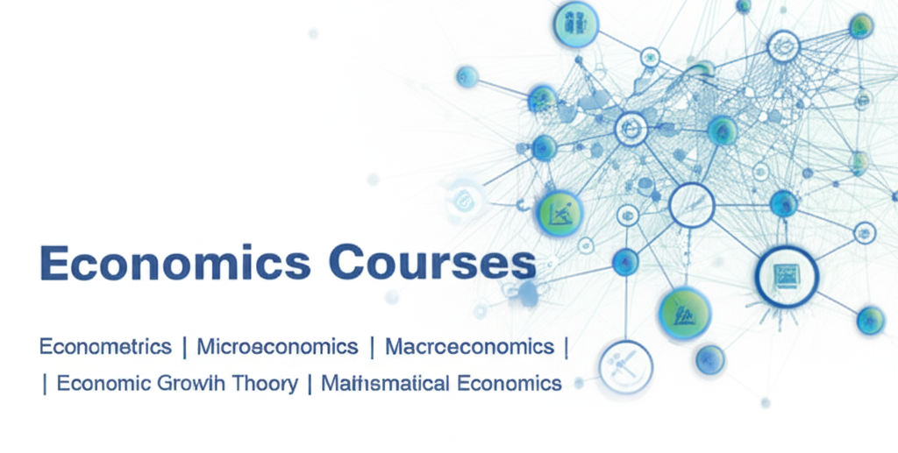

# 🎓 Bienvenido a mi plataforma académica 

Me complace darte la bienvenida a este espacio dedicado al aprendizaje y la exploración en el campo de la economía y los negocios. Esta plataforma funciona como un repositorio de materiales utilizados en mis clases universitarias, y está pensada para apoyar tu formación académica con contenidos claros, actualizados y relevantes.

📚 Aquí encontrarás presentaciones, apuntes y recursos complementarios correspondientes a los cursos que dicto, entre ellos:
- Economía matemática
- Microeconomía
- Investigación de mercados
- Economía I
- Entre otros temas especializados

Cada recurso está diseñado para ayudarte a comprender los fundamentos teóricos y prácticos de la disciplina, y para facilitar el análisis riguroso de los desafíos económicos contemporáneos.

🎯 Mi objetivo es ofrecerte herramientas que fortalezcan tu aprendizaje, promuevan el pensamiento crítico y te preparen para aplicar el conocimiento en contextos reales.
Gracias por visitar este espacio. Espero que encuentres aquí una fuente útil, clara e inspiradora para tu desarrollo académico.

📥 ¡Explora los materiales y aprovecha al máximo tu experiencia de aprendizaje

[**Contáctanos WhatsApp**](https://wa.me/message/CGKEXJDOX4NMB1 "Click aquí")
